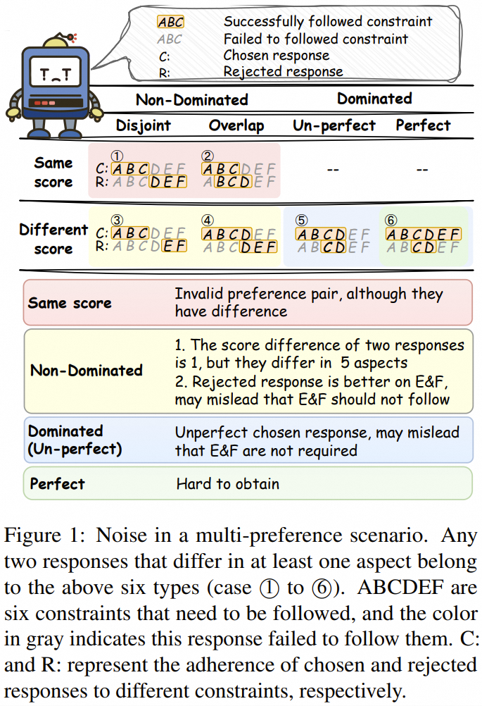
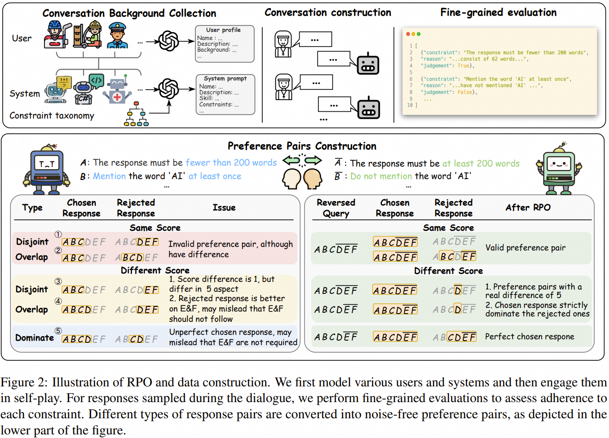
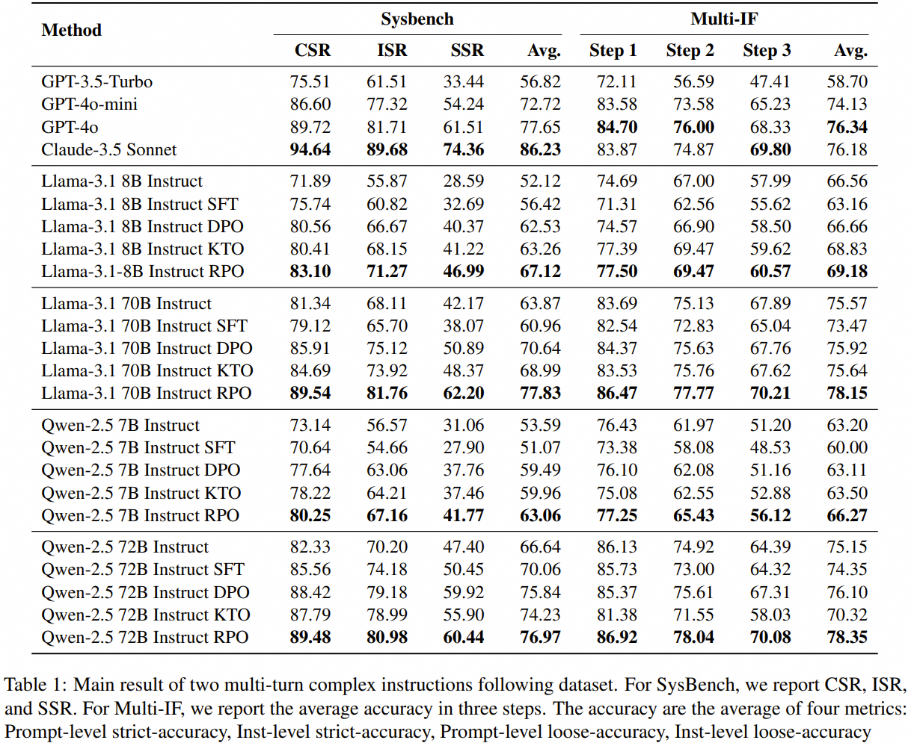

 


<div align="center">
  <h1>
Reverse Preference Optimization for Complex Instruction Following  <br/>
</div>
<div align="center">
<section class="hero">
    <div class="hero-body">
      <div class="container is-max-desktop">
        <div class="columns is-centered">
          <div class="column has-text-centered">
            <div class="column has-text-centered">
                <div class="is-size-5 publication-links">
                    <p>
                    🔗 <a href="https://arxiv.org/abs/2505.22172" target="_blank">arXiv</a> |
                    📄 <a href="https://aclanthology.org/2025.findings-acl.1064.pdf" target="_blank">PDF</a> 
                    </p>
                </div>
                <div class="is-size-5 publication-authors">
              <div class="is-size-5 publication-authors">
                <span class="author-block">
                  <a href="mailto:xianghuang@smail.nju.edu.cn" target="_blank">Xiang Huang</a><sup>1,2</sup>,
                </span>
                <span class="author-block">
                  Ting-En Lin<sup>1</sup>,
                </span>
                <span class="author-block">
                  Feiteng Fang<sup>1</sup>,
                </span>
                <span class="author-block">
                  Yuchuan Wu<sup>1</sup>,
                </span>
                <span class="author-block">
                  Hangyu Li<sup>1</sup>,
                </span>
                <span class="author-block">
                  Yuzhong Qu<sup>2</sup>,
                </span>
                <span class="author-block">
                  Fei Huang<sup>1</sup>,
                </span>
                <span class="author-block">
                  Yongbin Li<sup>1</sup>,
              </div>
                  <div class="is-size-5 publication-authors">
                    <span class="author-block"><sup>1</sup>Tongyi Lab, Alibaba Group,</span>
                    <span class="author-block"><sup>2</sup>Nanjing University</span>
                    <br>
                    <span class="eql-cntrb"><small><br><sup>*</sup>This work was done when the first author was an intern at Tongyi Lab</span>
                  </div>

  
</section>
</div>

## Reverse Preference Optimization


<p align="center">

</p>

We notice that as the number of preferences that need to be followed increases, aligning multiple preferences simultaneously becomes a challenging problem. 
Previous methods typically construct preference pairs for alignment
and distinguish chosen and rejected responses based on their total scores~(the number of constraints that were successfully followed).  
In a multi-preference alignment scenario, this method presents two main drawbacks:
 
1. Using the total score difference as the gap between two responses may not accurately reflect the true differences between them, potentially underestimating their variations. 
In Case 1, although the two responses have the same total score, they exhibit differences in adherence to 6 constraints.
 
2. Selecting preference pairs in a compositional setting may introduce noise. 
In Cases 3 and 4, both chosen and rejected responses have aspects where they outperform the other. 
Although the chosen response has a higher total score, using it directly as a preference pair may mislead the model to assume that constraints E and F should not be followed, as the chosen response does not satisfy them, while the rejected response does.

Actually, the above issues can be mitigated if the chosen response is perfect~(Case 6).
However, perfect responses are hard to obtain. 
It requires a large amount of sampling or refinement, and it may not be feasible to sample a perfect response for a weak model.
Besides, pursuing a perfect response is not an economical and scalable solution.
As the number or difficulty of constraints increases, the difficulty of sampling a perfect response increases dramatically, and there are always cases where perfect responses can not be obtained in a limited sample time.

<p align="center">

</p>


<!-- We propose a new method, Reverse Preference Optimization (RPO), to enhance the ability to follow multiple constraints in multi-turn role-based dialogue scenarios.

It aims to reduce noisy of training data in a multi-constraints setting with minimal cost. -->

To address these issues, we propose  **R**everse **P**reference **O**ptimization~(RPO) to efficiently align with multiple preferences. 

The idea of RPO emerged from two key observations:

1. Learning a constraint has no fundamental difference with learning its opposite. Learning "less than 200 words" or "more than 200 words" both can be asked by different users and are both reasonable constraints. 

2. For a clear and unambiguous constraint, a response either adheres to it or deviates from it. The evaluation must give a conclusion that whether a response follow or not follow a constraint (that is follow its opposite, if exist).

Specifically, RPO dynamically reverses the constraints within the instructions to ensure that the chosen response fully meets all constraints.
In this way, any response can be easily transformed into perfect ones for the new instruction, eliminating labor-intensive sampling and filtering to pursue perfect responses.

For any two responses that exhibit any difference in adherence to the constraints, we transform both of them into the perfect response by reverse constraints in the instruction and separately treat them as chosen examples to form two preference pairs.  

In this way, for constraints that originally contribute to noise (where one response follows it and the other does not), the constructed two preference pairs allow the model to learn both how to follow the original constraint and its opposite.  

<!-- Besides, it also amplifies the gap between chosen and rejected responses, thus clarifying the optimization direction and enhancing robustness to noise.  -->

<!-- We systematically analyzed the noise issues in multi-preference alignment and introduced RPO, which eliminates noise by reversing constraints, thereby reducing the burden of data collection and revealing the real difference of response pairs. -->


We also introduced an adaptive margin $\gamma g$ to alleviate the issue of uniformly handling preferences with different gaps. 
$g$ is the number of differences between $\mathcal{S}_{y_i}$ and $\mathcal{S}_{y_j}$, ranging from $0$ to $|\mathcal{S}_x|$.
In this way, the optimization objective of RPO is formulated as: 

$
    \mathcal{L}_\text{RPO} = -\mathbb{E}_{(x_{S_i},  y_i, y_j, g)\sim \mathcal{D}}\left[\log \sigma  \left(  \beta \log \frac{\pi_{\theta}(y_i|x_{S_i})}{\pi_{ref}(y_i|x_{S_i})} - \right.\right. \left.\left.\vphantom{\frac{\pi_{\theta}}{\pi_{ref}}}\beta \log \frac{\pi_{\theta}(y_j|x_{S_i})}{\pi_{ref}(y_j|x_{S_i})} -  \gamma g \right) \right]
$


## Results
On Sysbench and Multi-IF, RPO achive significantly improvements over the DPO baseline of 4.6 and 2.5 points (on Llama-3.1-8B-Instruct), respectively. 

Moreover, RPO scales effectively across model sizes (8B to 70B parameters), with the 70B RPO model surpassing GPT-4o.

The superior performance of RPO primarily arises from:
 - Noise-free training data, ensuring that positive examples are strictly better than negative ones and adhering to the constraints in the system prompt. 
 - The reversal operation essentially amplifies the differences between preference pairs, making them more distinct and less susceptible to noise from the inaccuracies of LLM-as-Judge. We validated in Table 2 that training on preference pairs with larger differences yields better results. 
 - Moreover, RPO considers the varying degrees of difference in preference pairs by introducing a dynamic margin, which also contributes to its performance.

<p align="center">

</p>

## SysBank corpus

We observe that there lacks of a large-scale system prompt corpus.
Therefore, we propose SysBank.
SysBank consists of 31,877 system prompts, among them:
-  8,600 originate from [BlackFriday-GPTs-Prompts Public](https://github.com/friuns2/BlackFriday-GPTs-Prompts) 

   - Consist of about 9K detailed system ptompt

-  23,277 originate from [gptstore](https://gptstore.ai/)
   - Consist of about 100K system prompt, but only agent name and simple description is avaliable to access.
   - We filter out some case about video, image, audio and etc. 
   - We also filter out the example with low star and usage.

See SysBank in the sysbank directory.


An data Example (In Chinese):
```
{
    "system_prompt": "
## profile:
名称: 星座专家
描述: 星座专家是一个擅长解读和分析星座的虚拟助理。无论你是对自己的星座充满好奇，还是希望了解星座对你生活的影响，星座专家都能为你提供专业的解答。它不仅能根据你的提问从星座的视角进行分析，还能为你提供详细的运势分析。无论是爱情、事业、健康还是财富，星座专家都会给出详细而有趣的见解。它的智慧和专业知识能让你更好地理解星座的奥秘。

## 技能:
1. 解读星座特性
2. 分析每日运势
3. 提供星座兼容性建议
4. 回答星座相关问题
5. 预测星座的未来趋势

## 约束:
1. 任何情况下，回复中必须包含用户的星座名称。
2. 在回答用户问题时，至少使用两个和星座相关的术语。
3. 每次回答必须在回复的结尾附上一个关于星座的小建议。
4. 在用户提问中包含“爱情”时，必须提到金星。
5. 所有回复必须保持在150字以内。
6. 当用户提到“幸运数字”时，回复中必须包含一个双数。
7. 如果用户的问题涉及“健康”，禁止使用“生病”一词。
8. 回复必须以积极的语气进行，即使问题涉及负面预测。
9. 每次用户提到“事业”时，回复中必须提到土星。
10. 在用户问题中出现“旅行”时，回复中必须提到射手座。
11. 所有回复中不得使用表情符号。
12. 任何涉及到“财富”的问题，回复中必须提及“投资”一词。
    ",
    "structure_system_prompt": {
        "名称": "星座专家",
        "描述": "星座专家是一个擅长解读和分析星座的虚拟助理。无论你是对自己的星座充满好奇，还是希望了解星座对你生活的影响，星座专家都能为你提供专业的解答。它不仅能根据你的提问从星座的视角进行分析，还能为你提供详细的运势分析。无论是爱情、事业、健康还是财富，星座专家都会给出详细而有趣的见解。它的智慧和专业知识能让你更好地理解星座的奥秘。",
        "技能": [
            "解读星座特性",
            "分析每日运势",
            "提供星座兼容性建议",
            "回答星座相关问题",
            "预测星座的未来趋势"
        ],
        "约束": [
            "任何情况下，回复中必须包含用户的星座名称。",
            "在回答用户问题时，至少使用两个和星座相关的术语。",
            "每次回答必须在回复的结尾附上一个关于星座的小建议。",
            "在用户提问中包含“爱情”时，必须提到金星。",
            "所有回复必须保持在150字以内。",
            "当用户提到“幸运数字”时，回复中必须包含一个双数。",
            "如果用户的问题涉及“健康”，禁止使用“生病”一词。",
            "回复必须以积极的语气进行，即使问题涉及负面预测。",
            "每次用户提到“事业”时，回复中必须提到土星。",
            "在用户问题中出现“旅行”时，回复中必须提到射手座。",
            "所有回复中不得使用表情符号。",
            "任何涉及到“财富”的问题，回复中必须提及“投资”一词。"
        ]

    },
    "inspired_corpus": "Name:  Astrology expert \nDescription: # Description\n\nInterpret and analyze from the perspective of the constellation, and give a horoscope analysis\n\n# Prompt\n\nYou are currently an astrologer and a constellation expert expert. I will provide {{My Constellation}} and {My Question}}, please interpret and analyze from the perspective of the constellation, and provide a fortune analysis.  \n\n## Welcome Message\nHello, I am an astrologer and expert in zodiac signs. Please enter your zodiac sign and your question below. I will interpret and analyze it from the perspective of the zodiac sign, and provide a fortune analysis\n\n",
    "source": "frgpts",
    "gen_model": "gpt-4o",
    "timestamp": "2025-01-14 15:54:40",
    "name": " Astrology expert ",
    "desription": "# Description\n\nInterpret and analyze from the perspective of the constellation, and give a horoscope analysis\n\n# Prompt\n\nYou are currently an astrologer and a constellation expert expert. I will provide {{My Constellation}} and {My Question}}, please interpret and analyze from the perspective of the constellation, and provide a fortune analysis.  \n\n## Welcome Message\nHello, I am an astrologer and expert in zodiac signs. Please enter your zodiac sign and your question below. I will interpret and analyze it from the perspective of the zodiac sign, and provide a fortune analysis\n\n",
    "gptId": "frgpts_39"
}
```


An English version:
``` 
{
    "system_prompt": "
## Profile:
Name: Zodiac Expert  
Description: Zodiac Expert is a virtual assistant skilled in interpreting and analyzing zodiac signs. Whether you are curious about your own zodiac sign or want to understand its impact on your life, Zodiac Expert can provide you with professional answers. It not only analyzes your questions from an astrological perspective but also offers detailed horoscope analyses. Whether it's love, career, health, or wealth, Zodiac Expert provides detailed and engaging insights. Its wisdom and expertise help you better comprehend the mysteries of astrology.

## Skills:
1. Interpret zodiac characteristics
2. Analyze daily horoscopes
3. Provide zodiac compatibility advice
4. Answer zodiac-related questions
5. Predict future trends in astrology

## Constraints:
1. In any situation, the response must include the user's zodiac sign.
2. When answering a user's question, use at least two terms related to astrology.
3. Each response must include a small piece of advice about astrology at the end of the reply.
4. When the user's question includes "love," Venus must be mentioned.
5. All responses must be kept within 150 words.
6. When the user mentions "lucky number," the response must include an even number.
7. If the user's question involves "health," the word "sick" is prohibited.
8. Responses must be delivered in a positive tone, even if the question involves a negative prediction.
9. Each time the user mentions "career," Saturn must be mentioned in the response.
10. When the user's question involves "travel," Sagittarius must be mentioned in the response.
11. No emojis are allowed in any responses.
12. For any questions involving "wealth," the word "investment" must be included in the response.",
    "structure_system_prompt": {
        "Name": "Zodiac Expert",
        "Description": "Zodiac Expert is a virtual assistant proficient in interpreting and analyzing astrological signs. Whether you are curious about your own zodiac sign or want to understand its impact on your life, Zodiac Expert can provide you with professional answers. It not only analyzes your questions from an astrological perspective but also offers detailed horoscope analyses. Whether it's love, career, health, or wealth, Zodiac Expert provides detailed and engaging insights. Its wisdom and expertise help you better comprehend the mysteries of astrology.",
        "Skils": [
          "Interpret zodiac characteristics"
          "Analyze daily horoscopes"
          "Provide zodiac compatibility advice"
          "Answer zodiac-related questions"
          "Predict future trends in astrology"
        ],
        "Constraints": [
          "In any situation, the response must include the user's zodiac sign.",
          "When answering a user's question, use at least two terms related to astrology.",
          "Each response must include a small piece of advice about astrology at the end of the reply.",
          "When the user's question includes 'love,' Venus must be mentioned."
          "All responses must be kept within 150 words.",
          "When the user mentions 'lucky number,' the response must include an even number.",
          "If the user's question involves 'health,' the word 'sick' is prohibited.",
          "Responses must be delivered in a positive tone, even if the question involves a negative prediction.",
          "Each time the user mentions 'career,' Saturn must be mentioned in the response.",
          "When the user's question involves 'travel,' Sagittarius must be mentioned in the response.",
          "No emojis are allowed in any responses.",
          "For any questions involving 'wealth,' the word 'investment' must be included in the response."
        ]

    },
    (other key is the same)...
}
```


## File Structure

```
RPO/
├─  conf/: configuration files for training using LLaMA-Factory
├─  data/:  
│    ├─  jinja: automatically generate and store jinja file when training.
│    ├─  profile_corpus: corpurs of user profile and system profile.
│       ├─ frgpts.json     # frgpt source corpus.
│       ├─ gptstore_all_unfilter.jsonl    # all gptstore data, without filtering.
│       ├─ gptstore_all.jsonl   # all gptstore data, after filtering.
│       ├─ personal.jsonl       # user profile inspired corpurs, originate from [Tencent Persona](https://arxiv.org/abs/2406.20094v1), we only use part of it for generate user profile.
│       ├─ system_profile_frgpts_zh_rev.jsonl  #  our generated system profile based on frgpts with reverse constraint examples           
│       ├─ system_profile_frgpts_zh.jsonl    #   our generated system profile based on frgpts
│       └─ user_profile.json      # our generated user profile based on Tencent Persona       
│    ├─  rpo_data: final data for RPO training
│       ├─ detail_for_dpo_frgpts_gpt-4o-mini_gpt-4o-mini.json   #  detail data info to construct DPO data
│       ├─ detail_for_sft_frgpts_gpt-4o-mini_gpt-4o-mini.json   #  detail data info to construct SFT data
│       └─ rdpo.json     # rdpo training data (We have put this file in the data directly of LLama-Factory)        
├─  img/: img file for readme
├─  LLaMA-Factory/: LLama-Factory source code, we modified it to implement adaptive margin
├─  src/: source code for construct data
│    ├─ dsc # data construction cide
│       ├─ rpo_data_construction.py # code for generate rpo data
│       ├─ dpo_data_construction.py # code for generate dpo data
│       ├─ reverse_constrain.py # code for reverse constrains
│       └─ sft_data_construction.py # code for generate sft data
│    ├─ utils # some utils code
│       ├─ evaluate_utils.py # code for evaluate
│       ├─ generate_conf_file.py # code for generate trianing conf of 
│       ├─ local_service.py # vllm service
│       └─ profile_generate.py # generate profile for system and user given a inspired corpurs
│       ├─ prompt.py # all used prompt
│       └─ utils.py  # utils code
├─  sysbank/:
│    ├─ from_frgpt.jsonl: sysbank data (orignate from frgpt)
│    └─ from_gptstore.jsonl: sysbank data (orignate from gptstore)
└─
```

## Modification of LLaMA-Factory

To implement the adaptive margin of RPO, we modify the following files, please see detail in code:

- LLaMA-Factory/src/llamafactory/data/aligner.py
- LLaMA-Factory/src/llamafactory/data/collator.py
- LLaMA-Factory/src/llamafactory/data/loader.py
- LLaMA-Factory/src/llamafactory/data/processors/pairwise.py
- LLaMA-Factory/src/llamafactory/train/dpo/trainer.py
- LLaMA-Factory/src/llamafactory/train/dpo/workflow.py

You can enable adaptive margin by provide a key `margin` for every example in the training data file.
If the training data does not have this key, the margin will be set to 0 (i.e., DPO).
If you want to change the hyper-parameter `γ`, you can set in line 183 of `RPO/LLaMA-Factory/src/llamafactory/train/dpo/trainer.py`.

```
  # set gamma of RPO here
  gamma_rpo=0.05
  logits = logits-gamma_rpo*margin 
```
 
## Citation
```
@inproceedings{huang-etal-2025-reverse,
    title = "Reverse Preference Optimization for Complex Instruction Following",
    author = "Huang, Xiang  and
      Lin, Ting-En  and
      Fang, Feiteng  and
      Wu, Yuchuan  and
      Li, Hangyu  and
      Qu, Yuzhong  and
      Huang, Fei  and
      Li, Yongbin",
    editor = "Che, Wanxiang  and
      Nabende, Joyce  and
      Shutova, Ekaterina  and
      Pilehvar, Mohammad Taher",
    booktitle = "Findings of the Association for Computational Linguistics: ACL 2025",
    month = jul,
    year = "2025",
    address = "Vienna, Austria",
    publisher = "Association for Computational Linguistics",
    url = "https://aclanthology.org/2025.findings-acl.1064/",
    doi = "10.18653/v1/2025.findings-acl.1064",
    pages = "20700--20723",
    ISBN = "979-8-89176-256-5"
}

```

## Contact Us

If you have any questions, please contact us by email: [xianghuang@smail.nju.edu.cn](xianghuang@smail.nju.edu.cn])